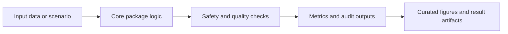

# TRI-X-CDSS

## Overview

Integrated TRI-X implementation package connecting triage, TiTrATE, governance, routing, and patient-level examples.

This repository is part of an eight-repository clinical decision-support research portfolio. Current status: manuscript or component package in preparation. The repository role is **implementation/integration**.

## Standard Repository Layout

| Path | Purpose |
|---|---|
| `src/` | Package source code: `trix_cdss` |
| `tests/` | Unit, smoke, and behavior checks |
| `scripts/` | Reproducibility and export scripts |
| `examples/` | Runnable examples and demonstrations |
| `figures/`, `visualizations/`, `outputs/`, `results/` | Generated visual and result artifacts |
| `data/`, `models/`, `evaluation/` | Dataset, model, and evaluation assets when used by this repo |
| `FIGURE_MANIFEST.csv` | Curated figure inventory for manuscript or component evidence |
| `pyproject.toml`, `setup.py`, `requirements.txt`, `pytest.ini` | Python package and test configuration |

## Architecture Flow



## Core Logic

- Load clinical scenario.
- Run core TRI-X components.
- Produce trajectory and interpretation artifacts.
- Validate package imports and example outputs.

## Key Formulas And Rules

- Tier output: y = G(R_triage, R_titrate, R_governance, R_route)
- Conservative decision: d = max_risk(d_triage, d_route, d_state)
- Implementation evidence: run example -> export trajectory -> verify smoke test

## Data, Results, Charts, And Graphs

The curated visual set is controlled by FIGURE_MANIFEST.csv and currently lists **3** figure entries. The manifest links figure IDs, roles, source scripts, source data, captions, sections, timestamps, and export DPI.

| ID | Role | PNG | PDF |
|---|---|---|---|
| TRIXCDSS-F1 | implementation | `examples\output\fig1_bppv_trajectory_epley_immediate.png` | `not listed` |
| TRIXCDSS-F2 | implementation | `examples\output\fig2_bppv_trajectory_comparison.png` | `not listed` |
| TRIXCDSS-F3 | implementation | `examples\output\fig3_shap_feature_importance.png` | `not listed` |

## Reproduce

```powershell
cd D:\PhD-NU\Manuscript\GitHub\TRI-X-CDSS
python -m venv .venv
.\.venv\Scripts\Activate.ps1
pip install -e .
python -m pytest -q
```

If figure-generation scripts are present, run the matching script listed in `FIGURE_MANIFEST.csv` from the repository root.

## Verification Criteria

- Root metadata and package files are present.
- Source paths follow `src/<package>/...` where the package shape allows it.
- Tests pass with `python -m pytest -q`.
- Curated figures are listed in `FIGURE_MANIFEST.csv` rather than inferred from every raw image file.
- Manuscript status wording stays conservative: in preparation, implementation, supplementary, or reproducibility/component evidence as appropriate.
- No local manuscript path, external assistant wording, or software metadata block is kept in the repository text.

## Portfolio Relationship

| Repository | Role |
|---|---|
| BASICS-CDSS | Beyond-accuracy evaluation methodology |
| TRI-X | Framework-level package |
| ORASR | Routing and safety-action component |
| DRAS-5 | Dynamic risk-state component |
| SAFE-Gate | Safety-gated ensemble framework |
| SynDX | Synthetic validation and explainability evidence |
| SURgul | SRGL/governance reproducibility component |
| TRI-X-CDSS | Integration and implementation package |

## Contact

**Chatchai Tritham**  
Department of Computer Science and Information Technology, Faculty of Science, Naresuan University, Phitsanulok 65000, Thailand  
Email: chatchait66@nu.ac.th  
ORCID: 0000-0001-7899-228X

**Chakkrit Snae Namahoot**  
Department of Computer Science and Information Technology, Faculty of Science, Naresuan University, Phitsanulok 65000, Thailand  
Email: chakkrits@nu.ac.th  
ORCID: 0000-0003-4660-4590